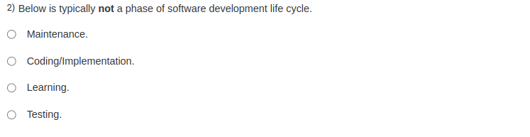

The phase that is typically not part of the software development life cycle (SDLC) is **Learning**. 

The SDLC generally includes phases such as:

1. **Requirement Gathering and Analysis**
2. **Design**
3. **Implementation (Coding)**
4. **Testing**
5. **Deployment**
6. **Maintenance**

"Learning" is not a formal phase in the SDLC, although continuous learning and skill improvement are important for developers.