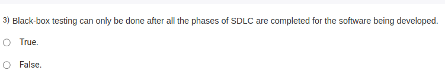

The correct answer is **False**.

Black-box testing can be performed at various stages of the Software Development Life Cycle (SDLC), not just after all phases are completed. It focuses on testing the functionality of the software without looking into the internal code or implementation. Black-box testing can be conducted during different stages, such as:

- **Unit Testing:** Testing individual components or modules.
- **Integration Testing:** Testing interactions between integrated modules.
- **System Testing:** Testing the entire system as a whole.
- **Acceptance Testing:** Testing the system's compliance with business requirements.

Thus, it can be performed during development, not only after all SDLC phases are completed. 