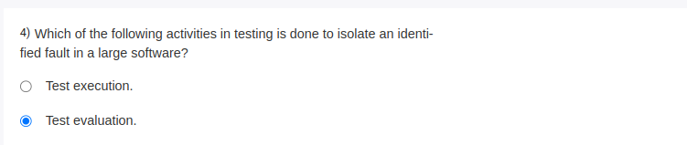

Apologies for the confusion. You're correct.

**Test evaluation** is the activity responsible for isolating an identified fault in large software systems. In this phase, the results of executed tests are analyzed to understand the nature of failures. Test evaluation helps in determining where the fault is located and what needs to be done to fix it, making it an essential step in the fault isolation process.

In contrast, **test execution** is about running the test cases, but the isolation of faults comes from evaluating those test results.