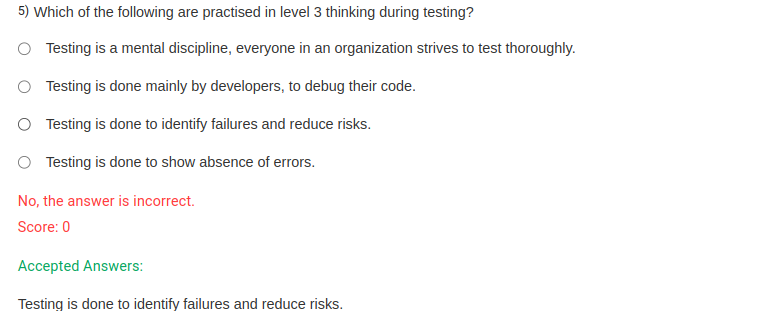

The correct option for **level 3 thinking** during testing is:

**Testing is done to identify failures and reduce risks.**

Level 3 thinking emphasizes risk-based and failure-identification testing, with the goal of proactively preventing issues rather than just fixing bugs. It involves a strategic approach where testing is seen as a means to mitigate risks and improve quality.